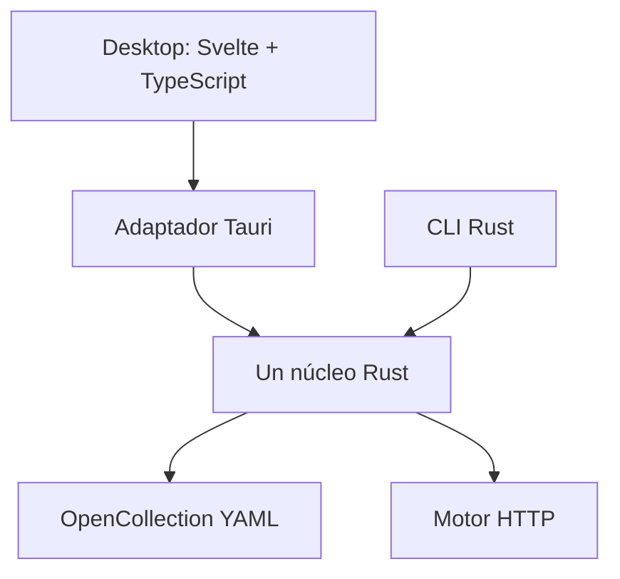

# RFC-0002 — Arquitectura inicial de NimblePost

Estado: arquitectura implementada para MVP 0 HTTP. Decisión inicial: 2026-09-30.
Organización del código actualizada: 2026-10-01.

## Objetivo y alcance

La primera entrega funcional abrirá una colección local, resolverá sus variables,
ejecutará HTTP y mostrará la respuesta. Desktop y una CLI mínima consumirán el
mismo núcleo Rust. Los archivos seguirán siendo la fuente de verdad.

Este RFC concreta las secciones 10, 11, 57 y 67 de la
[propuesta](../../roadmap/api-client-local-first-open-source-propuesta.md).
El [RFC-0003](0003-contrato-opencollection.md) define el almacenamiento.
El [núcleo Rust inicial](../../crates/core/README.md) implementa lectura de
requests/colecciones filesystem, resolución y HTTP con timeout/cancelación.
La [CLI mínima](../../bins/cli/README.md) y [Desktop](../../apps/desktop/README.md)
ya ejecutan ese mismo core. Desktop incluye edición, guardado seguro de requests
y environments e historial de metadatos. Bundled sigue pendiente.

## Componentes



- **Desktop:** Svelte 5, TypeScript y Vite; Tauri 2 como host. Estado de edición,
  navegación y presentación. No ejecuta HTTP ni escribe colecciones desde JS.
- **Core:** biblioteca Rust independiente de Tauri, WebView y salida de terminal.
  Lectura, validación, resolución, preparación de peticiones y ejecución.
- **CLI:** adaptador pequeño que llama a las mismas funciones que Desktop.
- **Archivos:** colecciones versionables. Preferencias, cachés e historial quedan
  fuera de la colección; no habrá una base de datos para reconstruir su contenido.

Estas elecciones provienen de la propuesta. Las dependencias del núcleo están
fijadas en Cargo.toml/Cargo.lock; se ha verificado con Rust 1.96.1. Las versiones
de Tauri (2.12.0), Svelte (5.57.1) y Vite (8.3.1) están fijadas en los manifests
y locks de Desktop.

## Organización del repositorio — 2026-10-01

```text
apps/desktop/
  src/
    main.ts                 # aplica tema y monta la aplicación
    App.svelte              # composición y coordinación de sesión/guardado
    assets/
      fonts/                # Inter variable y licencia OFL
      nimblepost-glyph-*.svg # marca para tema claro/oscuro
    styles/app.css          # tokens de tema y estilos de aplicación
    lib/
      desktop/api.ts        # único puente IPC y tipos de la UI
      layout/               # tema y dimensiones del sidebar
      components/
        Rows.svelte         # filas compartidas de requests/environments
        ui/                 # primitivas shadcn-svelte
      features/
        collections/tree.ts # construcción del árbol de navegación
        requests/           # borrador, tabs, RequestEditor y BodyEditor (CodeMirror diferido)
        responses/          # ResponsePanel, JSONViewer, formato y dimensiones
        workspaces/         # vista WorkspaceManager
  tests/
    unit/                   # pruebas Node de módulos puros del frontend
    ui/                     # regresiones de navegador con IPC en memoria
  src-tauri/
    src/
      main.rs               # entrada del ejecutable
      lib.rs                # arranque, plugins y registro de comandos
      commands.rs           # adaptadores de los comandos IPC
      session.rs            # sesión, revisiones, operaciones y última respuesta
      session/tests.rs      # pruebas del backend de Desktop
      workspaces.rs         # registro persistente de workspaces/referencias
      workspaces/tests.rs   # pruebas del registro local
      recovery.rs           # respaldo privado de pestañas y borradores de requests
      recovery/tests.rs     # corrupción, conflictos y permisos del respaldo
      watcher.rs            # notificaciones nativas de las colecciones activas
      watcher/tests.rs      # filtros, reemplazo de raíz y suscripciones nativas
    icons/                  # iconos nativos generados por plataforma
    capabilities/           # permisos Tauri
crates/core/
  src/                      # colección, variables, HTTP, storage, history e índice
  tests/                    # integración del motor y guardado YAML
bins/cli/
  src/main.rs               # adaptador CLI del core
  tests/                    # pruebas del ejecutable CLI
  README.md
tests/                     # contrato OpenCollection y fixtures compartidos
schemas/opencollection/1.0.0/
examples/basic-http/
docs/rfc/
roadmap/
```

### Responsabilidades y dependencias

- `features/` agrupa componentes y lógica por función. `RequestTabs` controla
  mediciones/scroll; `WorkspaceManager` presenta la lista y sus acciones.
  Ambos reciben datos y callbacks de `App.svelte`.
- `App.svelte` conserva la coordinación de la sesión: revisiones, borradores,
  ejecución, guardado y confirmaciones. Extraer una vista no duplica este estado.
  Sidebar y diálogos aún se componen aquí; su separación puede ser gradual.
- `lib/components/ui/` contiene shadcn; los controles nuevos reutilizan esas
  primitivas. Los componentes compartidos no importan implementaciones de features.
- `lib/desktop/api.ts` concentra los nombres/argumentos de los comandos y sus DTOs.
  Los módulos puros usan imports relativos para poder probarse también con Node;
  los componentes Svelte usan el alias `$lib` ya configurado.
- Tauri traduce IPC en operaciones de `Session`; `lib.rs` solo configura y
  registra esos adaptadores. El core sigue independiente de Tauri y de Svelte.
- `crates/core/src/workspace.rs` indexa una **colección** en disco. El registro de
  múltiples workspaces del usuario pertenece a `src-tauri/src/workspaces.rs`.
- Las pruebas de cada aplicación viven junto a ella. Los contratos/fixtures
  compartidos permanecen en la raíz; `npm test` ejecuta ambos grupos de Node.

Para ampliar una función existente, añade el código en su carpeta. Crea otra
carpeta cuando exista una responsabilidad nueva; no anticipes services, stores,
repositories ni crates para funciones que todavía no se implementan.

## Fronteras y flujo

1. El adaptador pide abrir una colección por una ruta elegida por el usuario.
2. El core conserva el texto original, valida y proyecta los campos soportados.
3. La selección de una petición usa su archivo e identificador local; no necesita
   insertar IDs propietarios en YAML. En documentos bundled usa una ruta de
   índices dentro de `items`, válida para esa revisión del documento.
4. El core resuelve variables y herencia, y valida que pueda ejecutar toda la
   configuración activa. No ignora silenciosamente scripts o autenticación.
5. El motor prepara y ejecuta HTTP. Los valores resueltos son transitorios.
6. El adaptador presenta estado, headers y fragmentos del body.
7. Guardar aplica un cambio al documento original según el RFC-0003, nunca al
   objeto con URL, headers o credenciales ya resueltos.

La API implementada cubre abrir/listar/leer, preparar/ejecutar/cancelar, editar,
guardar y leer fragmentos de respuesta. Enviar usa el borrador actual; guardar
es una operación explícita sobre las plantillas.
Los comandos Tauri son `choose_collection`, `open_example`, `read_request`,
`send_request`, `cancel_request` y `read_response`; no constituyen una API estable.
`save_document`, `read_environment`, `create_environment`, `read_history` y
`clear_history` completan los comandos de MVP 0. Los valores de secretos y el
override baseUrl son parámetros de ejecución; nunca son parte del guardado.
Los errores incluirán categoría, archivo y campo afectado, sin copiar valores
sensibles a mensajes de error.

## Dependencias y ejecución

- HTTP: Tokio, reqwest y TLS con rustls, según la propuesta. No depender
  directamente de hyper si reqwest cubre los requisitos iniciales.
- Storage: `yaml-rust2` valida la lectura y `yaml-edit` 0.3.2 localiza nodos
  conservando comentarios y representación. Las pruebas verifican bytes intactos
  y equivalencia semántica antes de habilitar el guardado. `serde` se usa para DTOs.
- Git: archivos utilizables con Git desde el comienzo. La interfaz de Git y el
  adaptador del Git del sistema llegan en MVP 1.
- Node: solo herramientas de desarrollo y build de la UI. El `package.json`
  valida contratos y construye Desktop; sus dependencias no forman parte del motor.
- Historial: JSON acotado a 200 entradas en datos de aplicación, con reemplazo
  atómico y campos de metadatos tipados. SQLite se pospone hasta necesitar búsquedas
  o mayor retención. La integración con keychain sigue pendiente; los secretos
  suministrados se mantienen únicamente en memoria.

El core no mantendrá un servidor ni daemon. Las operaciones largas serán
cancelables. La UI recibirá metadatos y referencias al body; se prevé lectura
por fragmentos de 64 KiB. Desktop retiene únicamente la última respuesta en Rust,
con máximo de 16 MiB; la UI carga el primer fragmento y permite solicitar más.

## Persistencia y seguridad inicial

El core autoriza operaciones dentro de las raíces abiertas. Los symlinks que
escapen de ellas requieren abrir la otra raíz explícitamente. No se atraviesa
`.git` ni se ejecutan comandos, scripts o plugins al abrir una colección.

Se rechazan YAML ambiguos y no se sobrescriben archivos modificados externamente.
La escritura de requests y environments está habilitada con pruebas de
conservación y detección de cambios externos en el backend Rust real.
Las respuestas HTML se muestran como texto en la primera versión.

## Orden de implementación y aceptación

1. **Contrato — esta entrega:** esquema fijado, fixtures con procedencia,
   diferencias registradas, campos iniciales y reglas de resolución/guardado.
2. **Storage Rust:** abrir bundled y colecciones de archivos; validar e identificar
   elementos sin cambiar un byte; editar/guardar con conservación y conflictos.
3. **HTTP y CLI mínima:** GET/POST contra un servidor local usando el mismo core;
   errores de conexión, timeout, cancelación y variables ausentes verificables.
4. **Desktop — MVP 0:** abrir → editar → enviar → inspeccionar → guardar, environments,
   variables y autenticación soportada; historial con política de metadatos.

No se considera implementado el contrato por haber validado ejemplos con Node.
El backend Rust deberá pasar los mismos fixtures y las pruebas de comportamiento
antes de utilizarse desde Desktop o CLI.

La [validación nativa de CI](../../.github/workflows/native-validation.yml) compila,
instala y abre los paquetes de Windows y Linux, y ejecuta las pruebas Rust.
Los resultados Windows/Linux x64 siguen pendientes. El
[RFC-0010](0010-presupuestos-rendimiento.md) conserva el protocolo de rendimiento
como referencia; sus herramientas y reportes se retiraron del repositorio.
Los objetivos absolutos pendientes no son garantías derivadas de elegir Tauri o Rust.


## Workspaces locales implementados

Desktop registra varias colecciones por workspace en `workspaces.json` dentro
del directorio de datos de Tauri. El registro contiene nombres, rutas canónicas,
acceso de solo lectura y selección activa; no cambia el formato de las
colecciones. El sidebar indexa cada árbol en Rust y selecciona una única raíz
para las operaciones del editor y HTTP. Cambiar de raíz invalida revisiones y
respuesta en memoria, y la UI exige guardar o descartar los borradores antes
de cambiar. Las referencias se restauran al iniciar; las carpetas inaccesibles
se conservan con un aviso. Quitar una referencia no borra la carpeta.

La última sesión de pestañas y borradores de requests se respalda por separado
en `recovery.json` dentro de los datos de Tauri. La UI guarda solo configuración
y selección, obtiene revisiones nuevas al reabrir y convierte archivos ausentes
o modificados en copias sin guardar. Las respuestas y los secretos suministrados
para ejecutar quedan fuera del respaldo. Las escrituras se ordenan y el cierre
normal espera el último respaldo; sus límites y política están en el README
de Desktop.

Las notificaciones de `notify` se emiten como `collection-changed`. La UI agrupa
las ráfagas y relee los árboles mediante `refresh_collections`, que conserva la
raíz activa y las revisiones. `inspect_request` compara bytes sin reemplazar el
snapshot abierto; un tab limpio se recarga y uno editado ofrece recarga o copia.
La desaparición de un request conserva su configuración como copia sin guardar.
El refresco al volver a enfocar y la acción manual complementan al watcher.
